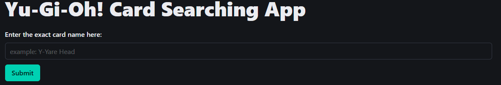
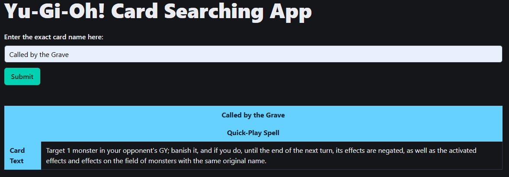
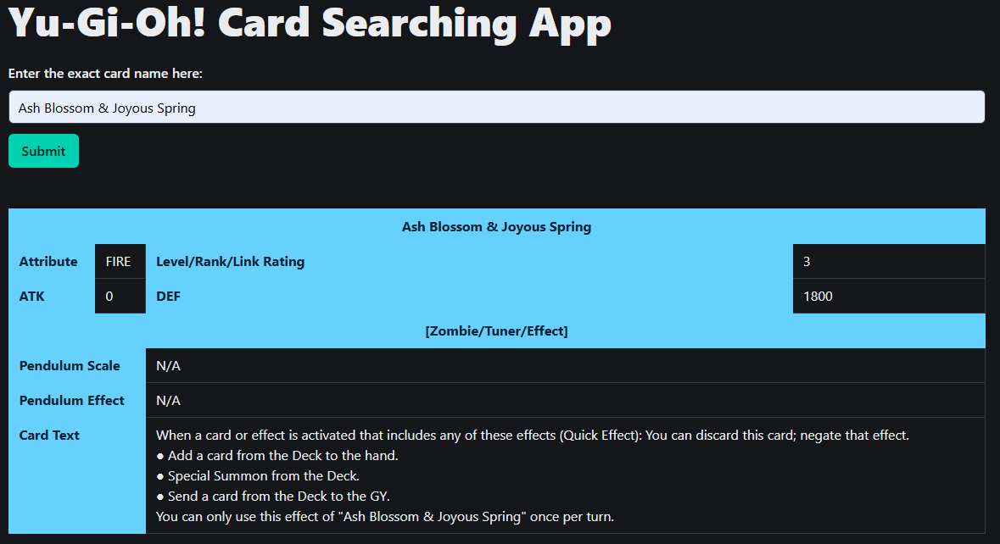
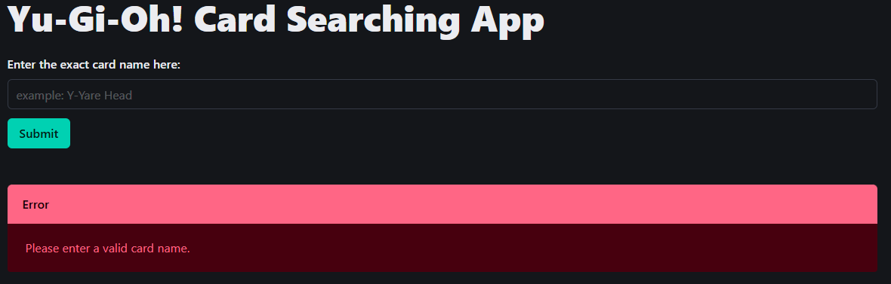
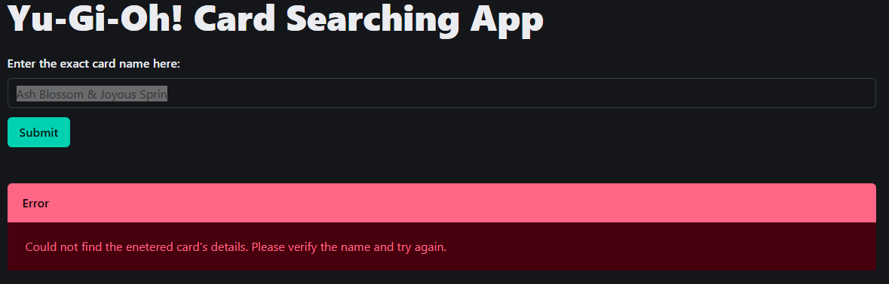

# Yu-Gi-Oh! Card Searching App
This is a simple app to search and retrieve the card details from the **Yu-Gi-Oh! Trading Card Game** using the [YGOPRODeck API](https://ygoprodeck.com/api-guide/) and styling done using [Bulma CSS](https://bulma.io/).

This project idea came to me after completing the **Learn Intermediate JavaScript** course from the [Codecademy](https://www.codecademy.com/) website. I wanted to build a simple web app using vanilla JavaScript **before** eventually re-creating it using React at a later date to compare and contrast the developer experience of building both apps.

## Why Yu-Gi-Oh?
As a fan of the TCG and an active player on **Yu-Gi-Oh! Master Duel** (the online version of the game), I just thought it would be a fun way of incorporating something I like into this project. On a more practical level, Yu-Gi-Oh cards are divided into 3 main categories (Spell, Trap and Monster Cards), all having both shared and unique properties, which seemed perfect to test my newly acquired knowledge of JavaScript.

## Yu-Gi-Oh! Card Properties
Below are the relevant card properties by category:

1. Spell/Trap Cards:
    * Card Name - The name displayed on the card.
    * Card Type - The type of Spell/Trap card (eg: Field, Equip, Counter, Normal etc).
    * Card Text - The text displayed on the card.
2.  Monster Cards:
    * Card Name - The name displayed on the card.
    * Card Type - An array of types that correspond to the monster card (eg: Fiend, Machine, Effect, Fusion etc).
    * Attribute - The attribute of the monster (eg: DARK, LIGHT, EARTH etc).
    * Card Frame - The backdrop type that the card uses (normal, effect, synchro, xyz etc).
    * Level - Between 1 and 12 (**not** applicable to Link and XYZ monsters).
    * Rank - Between 0 and 13 (**only** applicable to XYZ monsters).
    * Link Rating - Between 1 and 6 (**only** applicable to Link monsters).
    * ATK - Attack stat of the monster.
    * DEF - Defense stat of the monster (**not** applicable to Link monsters).
    * Pendulum Scale - The Pendulum Scale of the monster (**only** applicable to Pendulum monsters).
    * Pendulum Effect - The text printed in the Pendulum Effect area of the card (**only** applicable to Pendulum monsters).
    * Card Text - The text displayed on the card.

## Getting Started
There are **no** dependencies required for this project, all you need to do is to download the `index.html` file and open it in any browser.

## Using the App
Once opened in a broswer, all you need to do is enter the **exact** card name for which you want to retrieve the details off in the search bar:


Once done, you can click on the Submit button to retrieve and display the card details. For example, searching for the spell card "Called by the Grave" will produce the following output:


Since monster cards contain more details, they will be displayed as such:


### Error Checking
The app does perform some simple form of input validation and will render an error message in case of invalid card name:



### How does the App work?
The input field is located in a simple `form` element:
```html
<form>
    <div class="field">
        <label for="cardName" class="label">Enter the exact card name here:</label>
        <div class="control">
            <input type="text" id="cardName" placeholder="example: Y-Yare Head" class="input">
        </div>
    </div>
    <div class="control">
        <button class="button is-primary" type="submit">Submit</button>
    </div>
</form>
```

We then make use of the `querySelector()` and `getElementById()` methods to grab the DOM elements:
```js
const form = document.querySelector("form");
const input = document.getElementById("cardName");
```

Then we set up an event listener for the form's on-submit event to get and validate the input field value:
```js
form.addEventListener("submit", async event => {
    // Prevent page from refreshing
    event.preventDefault();

    // Get card name from input field
    const cardName = input.value;

    // Validate card name
    if (!cardName) {
        errorMsgBody.textContent = "Please enter a valid card name.";
        errorMsgContainer.className = "container";
        return;
    }
    else {
        // Clear any error messages
        errorMsgBody.textContent = "";
        errorMsgContainer.className = "is-hidden";

        // Retrieve card details
        const cardDetails = await getCardDetails(cardName);

        // Display card details
        await renderCardData(cardDetails);
    }
});
```

After this we can make a call to the YGOPRODeck API:
```js
const getCardDetails = async cardName => {
    // Encode card name and make endpoint
    const encodedCardName = encodeURIComponent(cardName)
    const endpoint = `${url}${encodedCardName}`;

    try {
        const response = await fetch(endpoint);
        if (!response.ok) {
            throw new Error("Could not find the enetered card's details. Please verify the name and try again.");
        }

        return response.json();
    }
    catch (err) {
        errorMsgBody.textContent = err.message;
        errorMsgContainer.className = "container";
        cardDetailTable.className = "is-hidden";
    }
}
```

Finally, if the call was successful, we can render the data that was returned:
```js
const renderCardData = async cardDetails => {
    // Extract card data
    const cardData = cardDetails.data[0];

    // Get DOM elements
    const monsterCardDetails = document.querySelectorAll("tr.monsterCardDetails");
    const name = document.getElementById("cName");
    const attribute = document.getElementById("cardAttribute");
    const level = document.getElementById("cardLevel");
    const atk = document.getElementById("cardATK");
    const def = document.getElementById("cardDEF");
    const pScale = document.getElementById("pScale");
    const pendulumEffect = document.getElementById("pendulumEffect");
    const type = document.getElementById("cardType");
    const cardText = document.getElementById("cardText");

    // Display card details
    name.textContent = cardData.name;
    if (cardData.frameType === "spell" || cardData.frameType === "trap") {
        type.textContent = cardData.humanReadableCardType;
    } else {
        type.textContent = `[${cardData.typeline.join("/")}]`;
        attribute.textContent = cardData.attribute;
        level.textContent = cardData.level ? cardData.level : cardData.linkval;
        atk.textContent = cardData.atk;
        def.textContent = cardData.def ? cardData.def : "N/A";
        pScale.textContent = cardData.scale ? cardData.scale : "N/A";
        pendulumEffect.textContent = cardData.pend_desc ? cardData.pend_desc : "N/A";
    }
    cardText.innerHTML = cardData.scale ? cardData.monster_desc.replace(/\r\n/g, '<br>') : cardData.desc.replace(/\r\n/g, '<br>');

    // Make table visible
    cardDetailTable.className = "container";
    if (cardData.frameType === "spell" || cardData.frameType === "trap") {
        monsterCardDetails.forEach(row => row.style.display = "none");
    } else {
        monsterCardDetails.forEach(row => row.style.display = "");
    }
}
```

The card details are displayed in a table:
```html
<div class="is-hidden" id="cardDetails">
    <table class="table is-bordered is-fullwidth">
        <tr>
            <th class="is-info" colspan="4" style="text-align: center;" id="cName"></th>
        </tr>
        <tr class="monsterCardDetails">
            <th class="is-info">Attribute</th>
            <td id="cardAttribute"></td>
            <th class="is-info">Level/Rank/Link Rating</th>
            <td id="cardLevel"></td>
        </tr>
        <tr class="monsterCardDetails">
            <th class="is-info">ATK</th>
            <td id="cardATK"></td>
            <th class="is-info">DEF</th>
            <td id="cardDEF"></td>
        </tr>
        <tr>
            <th class="is-info" colspan="4" style="text-align: center;" id="cardType"></th>
        </tr>
        <tr class="monsterCardDetails">
            <th class="is-info" colspan="2">Pendulum Scale</th>
            <td id="pScale" colspan="2"></td>
        </tr class="monsterCardDetails">
        <tr class="monsterCardDetails">
            <th class="is-info" colspan="2">Pendulum Effect</th>
            <td id="pendulumEffect" colspan="2"></td>
        </tr>
        <tr>
            <th class="is-info" colspan="2">Card Text</th>
            <td id="cardText" colspan="2"></td>
        </tr>
    </table>
</div>
```

Any errors will be displayed in the dedicated error notification section:
```html
<div class="is-hidden" id="errorMessage">
    <article class="message is-danger">
        <div class="message-header">
            <p>Error</p>
        </div>
        <div class="message-body"></div>
    </article>
</div>
```

### App Limitations
1. As mentioned above, you are required to enter the **exact** card name in order for the app to properly retrieve the data. The YGOPRODeck API does support fuzzy name search and searching by other properties such as the card type, attack stat and much more. As such, when I re-create the app using a web framework, I would like to enable support to search by multiple properties.
2. A major aspect of the appeal of Yu-Gi-Oh! is the art of the cards, however, while the YGOPRODeck API does return an array of image URLs, as per the API notes, you are **not** expected to hotlink images directly from the website, least you risk your IP address being blacklisted by them. I did think about displaying a generitic card image where the frame would match the one of the searched card. However, there are so many possible card frame in Yu-Gi-Oh! (especially when you consider Pendulum cards), that I quickly dropped the idea.
3. Using vanilla JavaScript means that I have no way of automatically binding my HTML to my code and instead need to imperatively grab the DOM elements:
```js
// Get DOM elements
const monsterCardDetails = document.querySelectorAll("tr.monsterCardDetails");
const name = document.getElementById("cName");
const attribute = document.getElementById("cardAttribute");
const level = document.getElementById("cardLevel");
const atk = document.getElementById("cardATK");
const def = document.getElementById("cardDEF");
const pScale = document.getElementById("pScale");
const pendulumEffect = document.getElementById("pendulumEffect");
const type = document.getElementById("cardType");
const cardText = document.getElementById("cardText");
```
This obviously will not scale very well in the longterm and is something I hope to address when using a web framework.

## Author
Thomas Brun - [@littl3fo0t](https://github.com/littl3fo0t)